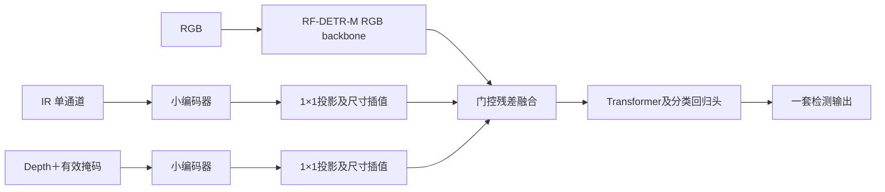

# CHF_v2 / CHF_v3 相对 YOLO V4.4 的技术变更

更新时间：2026-10-04。本文描述实际固定的 CHF_v2、CHF_v3，并以历史 **YOLO11s-P2 V4.4** 为比较基线。YOLO26m 配方复刻、RF-DETR-L、原图训练和后续局部门控实验是独立实验，不能混入这些版本的定义。

## 1. 结论

CHF_v2/v3 是检测架构、融合结构、预处理及训练日程的整体替换：以官方 RF-DETR-M 检测预训练建立强 RGB 起点，再用小型 IR/Depth 编码器向 RGB 特征注入受门控控制的残差。没有继承 YOLO 检测权重，也没有沿用 YOLO 的 P2 检测头和跨尺度空间记忆。

V2 的门控是每个特征层两项可训练常数；V3 增加由当前 RGB/IR/Depth 特征预测的每图门控。**V3 正式版本不是空间局部门控**，同一图像同一模态的门控在空间上统一。

## 2. 架构对照

| 项目 | YOLO V4.4 | CHF_v2 | CHF_v3 |
|---|---|---|---|
| 检测器 | YOLO11s-P2，独立三模态与空间记忆实现 | RF-DETR-M | 同V2 |
| RGB主干 | YOLO卷积编码器 | RF-DETR的DINOv2系Transformer编码器及投影 | 同V2 |
| 检测输出 | P2/P3/P4/P5密集检测，旧DFL解码与NMS链路 | Transformer查询式检测；官方后处理，不另做NMS | 同V2 |
| IR/Depth路径 | 独立证据编码、局部匹配和共用/私有融合 | 四层小卷积编码器＋1×1投影 | 同V2 |
| 融合位置 | 多尺度融合与记忆，回写YOLO检测链路 | RGB backbone输出与Transformer输入之间 | 同V2 |
| 融合控制 | 对齐/可靠性/记忆等机制 | 静态有界残差门控 | 静态偏置＋图像依赖MLP门控 |
| 跨尺度空间记忆 | 有 | 无 | 无 |
| 实际画布（H×W） | 配方736×1280 | 864×1536 | 864×1536 |

V4.4配置来源：[mm_v44_multimodal_ceiling.json](../configs/mm_v44_multimodal_ceiling.json)，架构选择为 `independent_p2_memory_v3`；实现来源：[independent_model.py](../mm_yolo/independent_model.py)、[independent_fusion.py](../mm_yolo/independent_fusion.py)。配置中Stage A/B各36轮是配方日程，不能仅凭配置证明某份历史提交权重实际跑完全部轮数。

## 3. RF-DETR融合的实际实现



辅助编码器通道依次为16、32、64、96，每层是3×3步长2卷积、GroupNorm(4组)、SiLU，总下采样16倍。IR和Depth编码器参数独立。辅助特征用1×1卷积投影至RGB特征通道；当前检查点记录为单层256通道，双线性插值匹配RGB特征空间尺寸。

### V2：静态残差

对每个特征层k：

```text
alpha_ir, alpha_depth = 0.2 * tanh(g[k])
F_out = F_rgb + alpha_ir * P_ir + alpha_depth * P_depth
```

`g`零初始化，初始输出与RGB检测器逐元素相同。辅助网络是可训练特征分支，不是98/1/1像素混合。

### V3：图像依赖门控

```text
z = concat(GAP(F_rgb), GAP(P_ir), GAP(P_depth))
MLP(z) = Linear(768,32) -> SiLU -> Linear(32,2)
alpha = 0.2 * tanh(g[k] + MLP(z))
F_out = F_rgb + alpha_ir * P_ir + alpha_depth * P_depth
```

MLP末层零初始化，因此从同一RGB权重构建V3时仍满足零门控等价。它可根据当前图像调整两种辅助证据的强度，但没有显式局部配准、空间偏移估计或每像素门控。

验证了初始输出等价，以及一次更新后IR/Depth辅助编码器具有有限非零梯度。正式版本参数全部打包到单一检查点，包含 `model`、`chf_aux`、`chf_channels`、融合类型及manifest。

## 4. 预处理变化

- 三模态按同名文件对应，以RGB原图标签为几何基准。
- V2/V3将图像直接固定resize至864×1536，训练仅同步水平翻转p=0.5；没有沿用V4.4的mosaic、目标裁剪、模态退化和较复杂几何增强。
- RGB使用ImageNet均值/标准差；IR灰度除255后用 `(x-0.5)/0.25` 归一化。
- uint16深度按毫米解释，有效范围300–20000mm，除20000并截断到[0,1]；无效位置填0，另输入有效掩码。
- uint8深度按编码图除255，有效性由值大于0确定；不能将它假称为真实米制距离。
- 深度和掩码使用最近邻resize；RGB/IR使用双线性resize。
- 旧YOLO实现保留相对深度、绝对距离及有效性等更丰富表示；RF融合版本简化为深度值＋有效掩码两通道。

## 5. 训练链路和固定权重

固定划分1600训练/400验证，seed42，split SHA256：
`4165ce54e9b34be51ec3f87d3065977eee310da3ce700fa4b5b19a85202ba00a`。

| 阶段 | 轮数 | 起点和训练方式 |
|---|---:|---|
| M RGB基础训练 | 24 | 官方RF-DETR-M检测预训练，640×640；batch8、eval4、lr1e-4、BF16，原默认增强 |
| M RGB高分辨率微调 | 12 | 从640最佳EMA权重初始化；864×1536，batch1累积8，eval1；lr2e-5、encoder lr2e-6、BF16、gradient checkpointing，新优化器和EMA |
| V2辅助融合 | 4 | 从高分辨率RGB最佳第7轮出发，冻结RGB及检测器，只训练辅助分支/投影/门控，FP32、batch1累积8、AdamW lr1e-4 |
| V3辅助融合 | 4 | 同一RGB最佳起点，动态门控；冻结RGB及检测器，其他基本配置同V2 |
| V3头部微调 | 2 | 加载当前辅助最佳，解冻分类/回归头；辅助lr5e-5、头lr1e-5，RGB backbone及Transformer仍冻结 |

V2辅助最佳在第2轮，增益未超过0.002阈值，未执行条件头部微调。V3有意无论辅助阶段增益是否超过0.002都执行头部2轮，最终最佳为第6轮。检测损失和Hungarian匹配使用RF-DETR官方实现，融合训练使用单query group，不能与原RGB的BF16/Group-DETR日程视为完全同配方。

旧V4.4配方为batch4累积4、BF16、两阶段各36轮，包含辅助独立训练、残差融合、不同学习率和分支/嵌入约束；不能把新旧结果差值单独归因于门控或分辨率。

## 6. 同口径验证成绩

400张留出集、12类、3252个GT。采用修正后的V4.4评分逻辑，预测正确映射到评估坐标系：

| 固定版本 | mAP50–95 | 说明 |
|---|---:|---|
| YOLO V4.4 | 0.4566793009 | 用户独立复现基线 |
| RF-DETR-M RGB | 0.5081687005 | FP32、全局最多100框的融合脚本基线 |
| CHF_v2 | 0.5098751359 | 辅助最佳第2轮 |
| CHF_v3 | 0.5103658436 | 动态融合最佳第6轮，同算法独立复现 |

V2相对V4.4提高约0.053196（5.320个百分点），V3提高约0.053687（5.369个百分点）；V3比V2仅高0.000491。RGB基线本身已比V4.4高0.051489，说明大部分观测增益来自整套RGB检测链路的替换，不能把全部增益归功于三模态融合。缺少控制所有变量的架构对照，无法再将这部分拆分为预训练、架构、分辨率各自的因果收益。

RGB native EMA报告0.5107893348/AP50 0.79596335，与融合FP32/最多100框口径不同，不能直接用它判定融合退步。V3 pycocotools为0.5103743165/AP50 0.7936739812，与修正评分0.5103658436有微小算法差异，报告时需写清口径。

### V3最佳权重的消融（pycocotools同流程）

| 输入 | mAP50–95 |
|---|---:|
| RGB＋IR＋Depth | 0.5103743165 |
| 仅RGB | 0.5091370762 |
| 去IR | 0.5094647143 |
| 去Depth | 0.5090520883 |

这些结果支持该检查点确实利用两种辅助模态，但收益不大。V3头部已经更新，因此消融“仅RGB”不是原始RGB起点0.5081687005。

## 7. 评分坐标修复及提交兼容性

原CHF标签是 **原图归一化** 的 `class cx cy w h confidence`。曾有外部脚本直接将其y/h乘736，而GT是1920×1080 letterbox到1280×736：有效图像1280×720，上下各补8。由此产生错误成绩V2=0.441116、V3=0.441632。

对该原尺寸图，正确映射为 `cy_canvas=(cy_original*720+8)/736`、`h_canvas=h_original*720/736`；其他原尺寸应按各自resize比与padding计算，不能固定套用8像素。修复后精确复现0.509875/0.510366，问题是评分映射，不是模型输出损坏。

提交TXT继续使用原图归一化坐标，不把评估letterbox补边写入原图标签。每图同名TXT、0–11类别、6列、有限合法坐标、置信度[0,1]、最多100框；无预测保留空TXT。官方后处理中不合法类别候选先过滤，再按分数保留最多100个合法框。导出原V3测试1000张已做400图同流程复现与文件完整性检查。

conf≥0.25过滤包是单独交付版本：1000文件、7589框、10个空TXT。阈值过滤不保证mAP更高；不能把上述完整预测验证AP自动赋给该阈值包。

## 8. 权重标识及复现实务

| 版本 | 服务器固定权重 | SHA256 |
|---|---|---|
| V2 | `/root/autodl-tmp/weights/CHF_v2/CHF_v2.pth` | `29c80a33803ddfc0ceeaa1d14a55c56e85bc2b26f95ad4cdf2be8ac6ba10befa` |
| V3 | `/root/autodl-tmp/weights/CHF_v3/CHF_v3.pth` | `936755d6f850ce7b19b12deb27b3af52df804ef4559f93cdabe1719b8ca7e977` |

服务器实现根为 `/root/autodl-tmp/chf_arch_baselines_20261003`。V2入口 `run_rf_trimodal_chf.py`；V3入口 `run_rf_dynamic_trimodal_chf.py`；RGB高分辨率入口 `run_rf_highres_chf.py`。运行前校验split和权重哈希，读取对应manifest/metrics/ablations；不能仅凭文件名辨认模型。以上服务器入口也是本工作区tools目录的审计依据，本次提交仅添加技术文档，不自动将所有未提交实验脚本纳入分支。

## 9. 不属于原V2/V3的后续实验

- V3全量2000张4轮微调：旧400张已参加训练，无独立验证AP，未用于已交付原V3标签。
- V3继续训练6轮：最佳第1轮pycoco AP95 0.5108825819，仅比原V3高0.000508。
- 空间局部门控6轮：最佳0.5104477042，未超过普通继续训练。
- 空间局部门控＋RGB最后两层解冻6轮：训练后未超过起点，最后0.5067248678；保留最佳为epoch0。
- 上述新结构没有证明有效增益，不将其改名为正式CHF_v3或覆盖提交包。
- 本报告都是固定留出集实验结果，不能保证官方隐藏测试集成绩；测试集只用于推理，未用于训练、选权重或调参。
