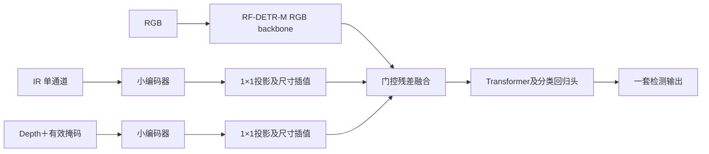

# CHF_v2 / CHF_v3 相对 YOLO V4.4 的技术变更

更新时间：2026-10-04。本文描述实际固定的 CHF_v2、CHF_v3，并以历史 **YOLO11s-P2 V4.4** 为比较基线。YOLO26m 配方复刻、RF-DETR-L、原图训练和后续局部门控实验是独立实验，不能混入这些版本的定义。

## 1. 结论

CHF_v2/v3 是检测架构、融合结构、预处理及训练日程的整体替换：以官方 RF-DETR-M 检测预训练建立强 RGB 起点，再用小型 IR/Depth 编码器向 RGB 特征注入受门控控制的残差。没有继承 YOLO 检测权重，也没有沿用 YOLO 的 P2 检测头和跨尺度空间记忆。

V2 的门控是每个特征层两项可训练常数；V3 增加由当前 RGB/IR/Depth 特征预测的每图门控。**V3 正式版本不是空间局部门控**，同一图像同一模态的门控在空间上统一。

## 2. 架构对照

| 项目 | YOLO V4.4 | CHF_v2 | CHF_v3 |
|---|---|---|---|
| 检测器 | YOLO11s-P2，独立三模态与空间记忆实现 | RF-DETR-M | 同V2 |
| RGB主干 | YOLO卷积编码器 | RF-DETR的DINOv2系Transformer编码器及投影 | 同V2 |
| 检测输出 | P2/P3/P4/P5密集检测，旧DFL解码与NMS链路 | Transformer查询式检测；官方后处理，不另做NMS | 同V2 |
| IR/Depth路径 | 独立证据编码、局部匹配和共用/私有融合 | 四层小卷积编码器＋1×1投影 | 同V2 |
| 融合位置 | 多尺度融合与记忆，回写YOLO检测链路 | RGB backbone输出与Transformer输入之间 | 同V2 |
| 融合控制 | 对齐/可靠性/记忆等机制 | 静态有界残差门控 | 静态偏置＋图像依赖MLP门控 |
| 跨尺度空间记忆 | 有 | 无 | 无 |
| 实际画布（H×W） | 配方736×1280 | 864×1536 | 864×1536 |

V4.4配置来源：[mm_v44_multimodal_ceiling.json](../configs/mm_v44_multimodal_ceiling.json)，架构选择为 `independent_p2_memory_v3`；实现来源：[independent_model.py](../mm_yolo/independent_model.py)、[independent_fusion.py](../mm_yolo/independent_fusion.py)。配置中Stage A/B各36轮是配方日程，不能仅凭配置证明某份历史提交权重实际跑完全部轮数。

## 3. RF-DETR融合的实际实现



辅助编码器通道依次为16、32、64、96，每层是3×3步长2卷积、GroupNorm(4组)、SiLU，总下采样16倍。IR和Depth编码器参数独立。辅助特征用1×1卷积投影至RGB特征通道；当前检查点记录为单层256通道，双线性插值匹配RGB特征空间尺寸。

### V2：静态残差

对每个特征层k：

```text
alpha_ir, alpha_depth = 0.2 * tanh(g[k])
F_out = F_rgb + alpha_ir * P_ir + alpha_depth * P_depth
```

`g`零初始化，初始输出与RGB检测器逐元素相同。辅助网络是可训练特征分支，不是98/1/1像素混合。

### V3：图像依赖门控

```text
z = concat(GAP(F_rgb), GAP(P_ir), GAP(P_depth))
MLP(z) = Linear(768,32) -> SiLU -> Linear(32,2)
alpha = 0.2 * tanh(g[k] + MLP(z))
F_out = F_rgb + alpha_ir * P_ir + alpha_depth * P_depth
```

MLP末层零初始化，因此从同一RGB权重构建V3时仍满足零门控等价。它可根据当前图像调整两种辅助证据的强度，但没有显式局部配准、空间偏移估计或每像素门控。

验证了初始输出等价，以及一次更新后IR/Depth辅助编码器具有有限非零梯度。正式版本参数全部打包到单一检查点，包含 `model`、`chf_aux`、`chf_channels`、融合类型及manifest。

## 4. 预处理变化

- 三模态按同名文件对应，以RGB原图标签为几何基准。
- V2/V3将图像直接固定resize至864×1536，训练仅同步水平翻转p=0.5；没有沿用V4.4的mosaic、目标裁剪、模态退化和较复杂几何增强。
- RGB使用ImageNet均值/标准差；IR灰度除255后用 `(x-0.5)/0.25` 归一化。
- uint16深度按毫米解释，有效范围300–20000mm，除20000并截断到[0,1]；无效位置填0，另输入有效掩码。
- uint8深度按编码图除255，有效性由值大于0确定；不能将它假称为真实米制距离。
- 深度和掩码使用最近邻resize；RGB/IR使用双线性resize。
- 旧YOLO实现保留相对深度、绝对距离及有效性等更丰富表示；RF融合版本简化为深度值＋有效掩码两通道。

## 5. 训练链路和固定权重

固定划分1600训练/400验证，seed42，split SHA256：
`4165ce54e9b34be51ec3f87d3065977eee310da3ce700fa4b5b19a85202ba00a`。

| 阶段 | 轮数 | 起点和训练方式 |
|---|---:|---|
| M RGB基础训练 | 24 | 官方RF-DETR-M检测预训练，640×640；batch8、eval4、lr1e-4、BF16，原默认增强 |
| M RGB高分辨率微调 | 12 | 从640最佳EMA权重初始化；864×1536，batch1累积8，eval1；lr2e-5、encoder lr2e-6、BF16、gradient checkpointing，新优化器和EMA |
| V2辅助融合 | 4 | 从高分辨率RGB最佳第7轮出发，冻结RGB及检测器，只训练辅助分支/投影/门控，FP32、batch1累积8、AdamW lr1e-4 |
| V3辅助融合 | 4 | 同一RGB最佳起点，动态门控；冻结RGB及检测器，其他基本配置同V2 |
| V3头部微调 | 2 | 加载当前辅助最佳，解冻分类/回归头；辅助lr5e-5、头lr1e-5，RGB backbone及Transformer仍冻结 |

V2辅助最佳在第2轮，增益未超过0.002阈值，未执行条件头部微调。V3有意无论辅助阶段增益是否超过0.002都执行头部2轮，最终最佳为第6轮。检测损失和Hungarian匹配使用RF-DETR官方实现，融合训练使用单query group，不能与原RGB的BF16/Group-DETR日程视为完全同配方。

旧V4.4配方为batch4累积4、BF16、两阶段各36轮，包含辅助独立训练、残差融合、不同学习率和分支/嵌入约束；不能把新旧结果差值单独归因于门控或分辨率。

## 6. 同口径验证成绩

400张留出集、12类、3252个GT。采用修正后的V4.4评分逻辑，预测正确映射到评估坐标系：

| 固定版本 | mAP50–95 | 说明 |
|---|---:|---|
| YOLO V4.4 | 0.4566793009 | 用户独立复现基线 |
| RF-DETR-M RGB | 0.5081687005 | FP32、全局最多100框的融合脚本基线 |
| CHF_v2 | 0.5098751359 | 辅助最佳第2轮 |
| CHF_v3 | 0.5103658436 | 动态融合最佳第6轮，同算法独立复现 |

V2相对V4.4提高约0.053196（5.320个百分点），V3提高约0.053687（5.369个百分点）；V3比V2仅高0.000491。RGB基线本身已比V4.4高0.051489，说明大部分观测增益来自整套RGB检测链路的替换，不能把全部增益归功于三模态融合。缺少控制所有变量的架构对照，无法再将这部分拆分为预训练、架构、分辨率各自的因果收益。

RGB native EMA报告0.5107893348/AP50 0.79596335，与融合FP32/最多100框口径不同，不能直接用它判定融合退步。V3 pycocotools为0.5103743165/AP50 0.7936739812，与修正评分0.5103658436有微小算法差异，报告时需写清口径。

### V3最佳权重的消融（pycocotools同流程）

| 输入 | mAP50–95 |
|---|---:|
| RGB＋IR＋Depth | 0.5103743165 |
| 仅RGB | 0.5091370762 |
| 去IR | 0.5094647143 |
| 去Depth | 0.5090520883 |

这些结果支持该检查点确实利用两种辅助模态，但收益不大。V3头部已经更新，因此消融“仅RGB”不是原始RGB起点0.5081687005。

## 7. 评分坐标修复及提交兼容性

原CHF标签是 **原图归一化** 的 `class cx cy w h confidence`。曾有外部脚本直接将其y/h乘736，而GT是1920×1080 letterbox到1280×736：有效图像1280×720，上下各补8。由此产生错误成绩V2=0.441116、V3=0.441632。

对该原尺寸图，正确映射为 `cy_canvas=(cy_original*720+8)/736`、`h_canvas=h_original*720/736`；其他原尺寸应按各自resize比与padding计算，不能固定套用8像素。修复后精确复现0.509875/0.510366，问题是评分映射，不是模型输出损坏。

提交TXT继续使用原图归一化坐标，不把评估letterbox补边写入原图标签。每图同名TXT、0–11类别、6列、有限合法坐标、置信度[0,1]、最多100框；无预测保留空TXT。官方后处理中不合法类别候选先过滤，再按分数保留最多100个合法框。导出原V3测试1000张已做400图同流程复现与文件完整性检查。

conf≥0.25过滤包是单独交付版本：1000文件、7589框、10个空TXT。阈值过滤不保证mAP更高；不能把上述完整预测验证AP自动赋给该阈值包。

## 8. 权重标识及复现实务

| 版本 | 服务器固定权重 | SHA256 |
|---|---|---|
| V2 | `/root/autodl-tmp/weights/CHF_v2/CHF_v2.pth` | `29c80a33803ddfc0ceeaa1d14a55c56e85bc2b26f95ad4cdf2be8ac6ba10befa` |
| V3 | `/root/autodl-tmp/weights/CHF_v3/CHF_v3.pth` | `936755d6f850ce7b19b12deb27b3af52df804ef4559f93cdabe1719b8ca7e977` |

服务器实现根为 `/root/autodl-tmp/chf_arch_baselines_20261003`。V2入口 `run_rf_trimodal_chf.py`；V3入口 `run_rf_dynamic_trimodal_chf.py`；RGB高分辨率入口 `run_rf_highres_chf.py`。运行前校验split和权重哈希，读取对应manifest/metrics/ablations；不能仅凭文件名辨认模型。以上服务器入口也是本工作区tools目录的审计依据，首次提交仅添加技术文档；本次实现细节补充另纳入V2、V3及RGB高分辨率三个直接相关脚本，其他实验文件不纳入。

## 9. 不属于原V2/V3的后续实验

- V3全量2000张4轮微调：旧400张已参加训练，无独立验证AP，未用于已交付原V3标签。
- V3继续训练6轮：最佳第1轮pycoco AP95 0.5108825819，仅比原V3高0.000508。
- 空间局部门控6轮：最佳0.5104477042，未超过普通继续训练。
- 空间局部门控＋RGB最后两层解冻6轮：训练后未超过起点，最后0.5067248678；保留最佳为epoch0。
- 上述新结构没有证明有效增益，不将其改名为正式CHF_v3或覆盖提交包。
- 本报告都是固定留出集实验结果，不能保证官方隐藏测试集成绩；测试集只用于推理，未用于训练、选权重或调参。

## 10. 可定位的代码入口和模块职责

本次补充将固定V2/V3的实现源码一并纳入分支，便于逐行核对：

| 源文件/对象 | 职责 |
|---|---|
| [run_rf_trimodal_chf.py](../tools/run_rf_trimodal_chf.py) | V2数据集、静态融合、训练、验证、检查点和消融 |
| [run_rf_dynamic_trimodal_chf.py](../tools/run_rf_dynamic_trimodal_chf.py) | V3，增加 `ResidualFusion.dynamic`；头部阶段无条件执行 |
| [run_rf_highres_chf.py](../tools/run_rf_highres_chf.py) | RGB高分辨率起点，替换resize变换并断言真实画布 |
| `Triples.__getitem__` / `collate` | 三模态预处理和COCO标签归一化；堆叠图像并保留目标列表 |
| `AuxEncoder` / `ResidualFusion` | 辅助证据提取、通道投影和门控残差 |
| `TriModel.hook` / `forward` | 在backbone返回值上注入融合，不改变位置编码和其他返回项 |
| `evaluate` | 原图像素坐标预测、过滤、top100、COCO评估 |

这些脚本依赖服务器安装的RF-DETR、PyTorch、torchvision、PIL、numpy和pycocotools。它们使用服务器绝对路径，不是脱离数据/权重/依赖即可运行的完整分发包。预训练文件和赛事数据不加入Git。

## 11. 输入、特征与检测输出张量

以下维度针对当前单层256通道检查点；B是物理batch，正式融合训练B=1。

| 数据 | 张量尺寸/类型 | 细节 |
|---|---|---|
| RGB | `[B,3,864,1536]` FP32 | ImageNet归一化 |
| IR | `[B,1,864,1536]` FP32 | 单通道独立归一化 |
| Depth | `[B,2,864,1536]` FP32 | 第0通道归一化深度，第1通道有效掩码 |
| 辅助编码器第1层 | `[B,16,432,768]` | Conv3×3/s2/p1 |
| 第2层 | `[B,32,216,384]` | 同上 |
| 第3层 | `[B,64,108,192]` | 同上 |
| 第4层 | `[B,96,54,96]` | 同上 |
| IR/Depth投影 | `[B,256,Hf,Wf]` | 1×1投影后插值至实际RGB特征Hf/Wf |
| V3池化描述子 | `[B,768]` | 三种256维空间均值拼接 |
| V3动态门控 | `[B,2]` | 广播至 `[B,1,1,1]` 后分别乘辅助投影 |
| 标签boxes | `[Ni,4]` FP32 | 原图归一化cx/cy/w/h |
| 标签labels | `[Ni]` int64 | 0–11 |
| 检测boxes/logits | `[B,Q,4]` / `[B,Q,C]` | Q/C由实际RF-DETR检查点及配置决定，不能假设后处理所有标签都合法 |

RGB特征空间尺寸由backbone运行时决定。源码通过一次真实前向记录 `channels=[f.tensors.shape[1] ...]`，融合按 `x.shape[-2:]` 插值；不硬编码RGB特征分辨率。辅助投影使用 `align_corners=False`。

每个样本的COCO xywh标签转换为：

```python
boxes = [(x + bw / 2) / original_w,
         (y + bh / 2) / original_h,
         bw / original_w,
         bh / original_h]
# 三模态同步水平翻转时
boxes[:, 0] = 1 - boxes[:, 0]
```

直接resize的几何变换下，归一化cxcywh保持对应关系。`orig_size=[original_h, original_w]`保留至验证，供RF-DETR后处理还原像素坐标。

## 12. Hook注入和位置编码处理

```python
# net = detector.model.model
handle = net.backbone.register_forward_hook(hook)

def hook(module, inputs, outputs):
    if current is None:
        return outputs
    ir, depth = current
    features, pos, cross = outputs
    fused = fusion(features, ir, depth, use_ir, use_depth)
    return fused, pos, cross
```

融合结果重新包装为 `NestedTensor(x, f.mask, f.no_padding)`，沿用RGB的mask和no_padding；pos和cross原样传递。辅助图像的几何网格必须与RGB一致，否则此注入并不会自动纠正跨模态错位。

`TriModel.forward`断言RGB尺寸，设置当前辅助输入，在 `try/finally` 中调用net并清空current，避免异常后遗留上批辅助输入。实现依赖可变实例状态，适用于当前串行前向；不能不经修改就视为同一模型实例多线程并发安全。

## 13. 零初始化为什么不阻断训练

V2令 `g=0`；V3另令MLP最后一层权重和bias为0。此时辅助残差恰为0，预测logits和boxes的最大绝对误差必须为0，而不只是“接近”。

初始时门控导数 `d(0.2*tanh(g))/dg=0.2`，所以门控可以立即收到梯度。由于辅助特征乘以零门控，辅助编码器的第一步梯度可能为零；门控更新非零后，梯度才进入编码器和投影。V3同理：MLP末层可先更新，上游MLP层的梯度随之建立。

冒烟检查先验证门控有限非零梯度，再执行一次优化、清梯度、重新前向反向，确认IR和Depth编码器至少一项梯度有限非零。仅检查 `requires_grad=True` 或门控数值变化不足以证明模态网络被有效训练。

## 14. 训练模式、损失和优化器的逐步逻辑

### 14.1 冻结范围

辅助阶段将 `net.parameters()` 全部 `requires_grad_(False)`，只将 `fusion` 参数交给AdamW。前向中RGB及检测器 `net.eval()`，辅助模块 `fusion.train()`。`eval()`不会关闭autograd：检测器虽然不更新参数，仍需对融合输入求导，才能训练辅助网络。

头部阶段仅解冻以下参数名前缀：

```python
('class_embed.', 'bbox_embed.',
 'transformer.enc_out_class_embed.',
 'transformer.enc_out_bbox_embed.')
```

RGB主干、其他Transformer参数继续冻结。重新建立AdamW参数组，不是恢复旧阶段的优化器动量。

### 14.2 损失与梯度累积

`TrainConfig(batch_size=1, grad_accum_steps=8, seed=42)`用于构建官方criterion/postprocessor；自定义循环使用官方criterion返回的损失及其 `weight_dict`，没有新加YOLO的DFL、旧分支检测监督或记忆约束：

```python
loss_dict = criterion(model(rgb, ir, depth), targets)
loss = sum(value * criterion.weight_dict[key]
           for key, value in loss_dict.items()
           if key in criterion.weight_dict)
assert torch.isfinite(loss)
(loss / 8).backward()
if (step + 1) % 8 == 0:
    torch.nn.utils.clip_grad_norm_(trainable_params, 0.1,
                                  error_if_nonfinite=True)
    optimizer.step()
    optimizer.zero_grad(set_to_none=True)
```

1600样本可整除8，每轮200次优化更新，不存在本实验的尾批累积遗漏。融合训练FP32，不使用autocast/GradScaler。AdamW weight decay为1e-4；融合阶段lr1e-4，头部阶段辅助5e-5、头1e-5，无该循环自定义学习率调度器。

每轮训练损失是1600个未除8的原始总损失均值。官方criterion可含主检测和辅助输出损失，数值不可直接与YOLO损失或RGB原生日志比较。

### 14.3 最佳选择

先完整验证零门控RGB基线并保存epoch0 best；各轮保存last，只有AP95严格超过当前best才更新best。V2完成辅助4轮后，若 `best-baseline <= 0.002`，直接跳过头部阶段；V3移除了这一条件，加载辅助最佳后执行2轮头部训练。结束加载整体最佳再做四种消融，不用last代替best。

## 15. 验证/导出解码细节

RF-DETR `post(outputs, sizes)` 此处sizes是 `[H,W]`，不是之前DEIM/D-FINE链路所需的 `[W,H]`；两种后处理不可共用坐标顺序。

后处理返回scores/labels/xyxy boxes，每图按score降序遍历：

1. 将x1/x2截断到 `[0, original_w]`，y1/y2截断到 `[0, original_h]`。
2. 排除类别不在0–11、坐标不有限、宽或高不为正的候选。
3. 每个合法候选转换成原图像素xywh；满100个合法框后停止。
4. 预测与COCO原图GT一起送pycocotools，使用该批实际image_id集合。
5. 提交时xyxy转原图归一化cxcywh，写入6列TXT。

不额外加入NMS，不在报告AP的这条路径设置conf0.25。非法类别过滤规则同样用于验证和导出；不能在看到测试内容后单独更改类别规则。

模态消融会在辅助模块中关闭相应编码器，并用零特征填充该模态投影；V3描述子也随之改变，所以“去IR”不仅删除IR残差，还改变动态门控条件。这是实现层面的模态删除实验，不等价于固定两门控、仅把某个残差事后设零。

## 16. 检查点加载和版本恢复

保存以RGB基底字典为基础，替换完整检测器参数并加入辅助参数：

```text
model            -> net.state_dict()，包含实际更新后的检测头
chf_aux          -> fusion.state_dict()
chf_channels     -> 运行时测得的融合层通道
chf_fusion_type  -> V2静态 / V3 dynamic_v1 的类型标识
chf_manifest     -> 起点、画布、split、预处理与训练配置
chf_epoch        -> 最佳或当前轮次
chf_metrics      -> 对应验证分数
```

恢复V3推理应先建立RFDETRMedium，再严格加载 `model`，创建动态 `TriModel`，严格加载 `chf_aux`，转eval。不能只调用原生RFDETRMedium而忽略chf_aux，否则得到的是缺少辅助融合的不同模型。静态V2融合类也不能拿来加载V3动态参数而忽略missing/unexpected keys。

初始RGB阶段使用EMA最佳权重；V2/V3自定义融合循环保存当前集成网络，没有另建融合EMA。V2/V3 best/last未保存自定义循环optimizer与完整随机状态，因此它们能用于推理/权重初始化，不能声称支持逐位等价的优化器断点续训。

复现命令（执行前准备数据和原RGB权重，输出目录必须不存在）：

```bash
cd /root/autodl-tmp/chf_arch_baselines_20261003
python run_rf_trimodal_chf.py \
  --weights runs/rfdetr_m_highres_864x1536_20261003/checkpoint_best_ema.pth \
  --out runs/reproduce_v2
python run_rf_dynamic_trimodal_chf.py \
  --weights runs/rfdetr_m_highres_864x1536_20261003/checkpoint_best_ema.pth \
  --out runs/reproduce_v3
```

两命令是分别从相同RGB起点训练V2/V3，不是V2接着训练变成V3。可先添加 `--smoke` 执行等价与梯度检查，但冒烟也占用输出目录，应使用单独smoke目录。

## 17. 旧YOLO代码与新实现的具体区别

旧 `IndependentMMYOLO` 从YOLO主干前11层复制IR和Depth证据编码器，将辅助stem输入变成单通道，初始化卷积权重为原RGB输入通道权重之和。另有四通道metric分支注入深度尺度特征。这与RF版本的小型随机初始化辅助卷积网络不同。

`IndependentBranchDetector` 为训练阶段提供各辅助模态的P2–P5 neck和检测器监督，部署时不通过这些训练用分支输出投票。融合实现包含common/private证据、有效性/可靠性、匹配及跨尺度memory；`ComplementaryFusion`将记忆上下文、模态身份和门控用于多轮读取。其余后续router类属于其他版本，不能因为同文件中存在就说V4.4都用了。

RF版移除了这些训练用分支检测头、metric独立编码及共用/私有记忆机制，把辅助模态作用集中在检测Transformer之前的一个残差注入位置。因此“V3动态门控”并非把旧YOLO空间记忆完整移植到RF-DETR：计算更轻，设计更简单，但缺少旧方案的显式局部匹配和跨尺度证据管理。
