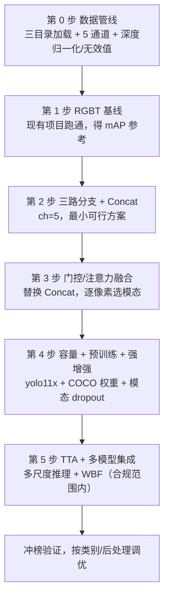
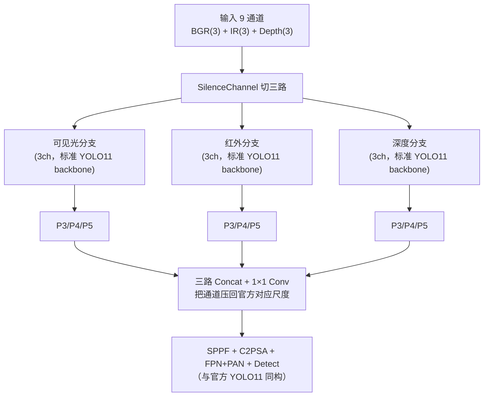

# 处理改进思路

> 面向「城市场景视觉多模态目标检测」竞赛，基于现有项目 DDBBPPT（YOLOv11-RGBT）的模型改进方案。
> 数据模态：可见光 + 红外 + 深度（三模态，已对齐）。目标：最大化识别准确度、泛化能力与鲁棒性。

> **当前状态**：本方案已完成代码落地，并合并了同赛题分支 `feature/multimodal-detection-framework` 的工程增强。核心改动文件：`ultralytics/data/base.py`（三目录加载 + 9 通道 + 深度对齐/归一化 + 模态增强）、`ultralytics/data/augment.py`（`RandomHSV9C`）、`ultralytics/cfg/default.yaml`（12 个新参数）、`ultralytics/cfg/models/11-RGBT/yolo11-RGBTD-midfusion.yaml`、`transfer_pretrained.py`、`train_RGBTD.py` / `val_RGBTD.py`、`scan_data.py` / `split_data.py`。使用方法见 `RGBTD三模态模型使用教程.md`。

---

## 一、源模型的处理思路（现有项目是怎么做的）

现有项目并非"把多张图直接拼成一张大图喂给一个 YOLO"，而是一套**「双分支骨干 + 多尺度中间融合 + 单检测头」**的可插拔框架。核心就三件事：**通道解耦 → 双分支特征提取 → P3/P4/P5 三尺度融合**。

### 1. 数据层：RGBT 通道是怎么拼出来的

入口在 `ultralytics/data/base.py`：

- 训练配置里定义 `pairs_rgb_ir = ['visible', 'infrared']`，本质是一对**字符串替换**：加载可见光图时，把路径里的 `visible` 替换成 `infrared` 得到红外图路径（`file_path.replace(pairs_rgb, pairs_ir)`）。
- 加载逻辑（`load_and_preprocess_image` 中 `use_simotm == 'RGBT'` 分支）：
  1. `im_visible = imread(file_path)` 读入可见光 BGR（3 通道）；
  2. `im_infrared = imread(..., IMREAD_GRAYSCALE)` 读入红外单通道灰度（1 通道）；
  3. `_resize_images` 把两张图对齐到同一分辨率；
  4. `_merge_channels` 用 `cv2.merge((b, g, r, im_infrared))` 拼成 **4 通道（BGR + IR）**。
- 通道顺序是 **BGR + 红外**（注意是 BGR 而非 RGB，因为 `cv2.imread` 默认 BGR），后续骨干按这个顺序切分。

结论：源模型把"可见光 + 红外"编码为一个 4 通道张量，由下游网络自行拆分。

### 2. 模型层：通道解耦 + 双分支骨干

核心算子 `SilenceChannel(c_start, c_end)`（`ultralytics/nn/modules/conv.py`）做的事很简单：对输入张量做通道切片 `x[..., c_start:c_end, :, :]`。以主力配置 `yolo11-RGBT-midfusion.yaml` 为例：

- `SilenceChannel[0, 3]` 切出可见光分支（BGR 三通道）；
- `SilenceChannel[3, 4]` 切出红外分支（单通道）。

于是 4 通道输入被**拆成两条完全独立的 YOLO11 骨干**，各自经过 `Conv` 下采样（64→128→256→512→1024）与 `C3k2` 特征提取，分别产出 P3（1/8）、P4（1/16）、P5（1/32）三个尺度。

### 3. 融合层：在 P3/P4/P5 三尺度做中间融合

在 YAML 里，可见光分支的第 6/8/10 层与红外分支的第 16/18/20 层分别对应 P3/P4/P5，用 `Concat` 在通道维拼接：

```
P3: Concat([6, 16])   P4: Concat([8, 18])   P5: Concat([10, 20])
```

融合后经 `SPPF + C2PSA`，再进入一个共享的 **FPN + PAN 检测头**，最后用**单个 Detect 头**输出检测结果。

### 4. 关键设计：融合"算子"是可插拔的

源模型把"在哪里融合"固定（P3/P4/P5），但"怎么融合"做成可替换模块，这正是它的扩展性所在。项目已内置的融合算子谱系：

| 融合算子 | 位置 | 本质 |
|---|---|---|
| `Concat` | midfusion 基线 | 通道拼接 |
| `NiNfusion` | conv.py | 拼接 + 1×1 卷积 + SiLU |
| `LearnableWeights` | conv.py | 可学习加权和 `w1·x1 + w2·x2` |
| `LearnableCoefficient` | conv.py | 可学习缩放 `x·bias` |
| `ZeroConv2d` | conv.py | 权重初始化为 0 的卷积（ControlNet 思想） |
| `TransformerFusionBlock` | conv.py | ICAFusion 式交叉注意力 |
| `CrossAttention` / `CrossAttentionShared` | conv.py / block.py | 跨模态注意力（后者共享 QKV 权重） |
| `CBFuse` | block.py | 插值对齐到同一尺寸后求和 |
| `ADD` | block.py | 带系数的逐元素相加 |

模型层面还支持 early / mid / late / score / share 等多种融合层次，以及 MCF（零卷积渐进注入）、PGI、CAS/CMA（通道/空间注意力门控）等变体，对应 `ultralytics/cfg/models/11-RGBT/` 下 40+ 个 YAML。

### 5. 一句话概括源模型

> **4 通道（BGR+IR）输入 → 通道切片解耦成可见光/红外两条骨干 → P3/P4/P5 三尺度中间融合 → 共享 FPN+PAN 头 → 单 Detect 输出。** 融合位置固定、融合算子可插拔，是它的最大特点。

---

## 二、针对三模态数据的模型改进思路

现有数据是**三模态（可见光 + 红外 + 深度）**，而源模型只支持两模态。竞赛目标是**准确度、泛化、鲁棒性三者最大化**，所以改进思路与"写论文"不同——不追求新颖干净，只追求测试分数最高。核心路线是：**把三分叉结构做进同一个模型，特征级融合，容量拉满、预训练拉满、增强拉满、集成兜底。**

### 改进点 0：数据层支持三目录 + 三模态通道编码

源模型的 `pairs_rgb_ir` 只支持两个目录的字符串替换，需扩展为三目录。加载逻辑改动：

1. **支持三目录**：`['visible', 'infrared', 'depth']`，加载时分别替换路径得到三个模态；
2. **编码为 5 通道**：`BGR(3) + IR(1) + Depth(1)`，`ch: 5`；
3. **深度归一化**：深度是 16bit 毫米、范围大（0~19999），直接喂会"淹掉"RGB/红外，需做**反深度（1/d）或逐帧 min-max 归一化**压到稳定 [0,1]；
4. **无效值处理**：深度为 0 或过小表示无效（空洞），训练时需特殊处理（置 0 或掩码），不能当真实距离；
5. **红外降冗余**：赛题红外是"3 个相同单通道堆叠"，直接取 1 通道即可，避免拼 3 个重复通道。

### 改进点 1（最小可行，先出基线）：三路分支 + 三路 Concat

在 midfusion YAML 上复制一条红外分支改为深度分支，`ch: 5`，融合处 `Concat` 拼接三个来源：

- `SilenceChannel[0,3]` 可见光分支；
- `SilenceChannel[3,4]` 红外分支；
- `SilenceChannel[4,5]` 深度分支；
- P3/P4/P5 各做三路 `Concat`。

这是半天能跑通、作为对照基线的方案。优点：改动极小、直接复用现有管线；缺点：通道数翻三倍，显存开销大。

### 改进点 2（核心创新）：三模态专用融合算子

把三路 `Concat` 换成三模态专用融合，由简到难、增益递增：

1. **可学习加权和**：把两路的 `LearnableWeights` 推广成三路 `w1·RGB + w2·IR + w3·Depth`，权重可打印，便于分析"哪个模态贡献最大"；
2. **三路交叉注意力**：把两两设计的 `CrossAttention` / `TransformerFusionBlock` 推广成三组双向交叉注意力（RGB↔IR、RGB↔Depth、IR↔Depth），或更优雅地做**共享 Query 的三路融合**——让 IR、Depth 都去 attend 一个 RGB 主导的 Query（以可见光为"锚"，把几何与热辐射信息对齐到外观特征上）；
3. **门控/选择式融合（最推荐）**：对应项目里的 CAS/CMA 系列，给每个模态学一个**空间-通道注意力掩码**，让网络逐像素决定"信谁"。深度（几何边缘锐利、尺度层次）+ 红外（暗处/温度目标）在**空间上互补**，门控融合最能吃到这种互补性——这是三模态相对 RGBT 最有说服力的动机，也直击竞赛要的"准确度 + 鲁棒性"。

### 改进点 3（泛化/鲁棒性）：模态 dropout + 强数据增强

- **模态 dropout / 随机加噪**（重点）：训练时以一定概率随机把某个模态置零、加高斯噪声或遮挡，让模型学会在"某模态缺失/退化"时仍能检测。三模态竞赛几乎必做——同时提升对传感器故障、遮挡、跨场景的鲁棒性，并直接压低过拟合；
- **强数据增强**：Mosaic、MixUp、CopyPaste 全开，再对三个模态独立做随机几何/色彩扰动。

### 改进点 4（准确度下限）：大容量 + 强预训练 + 高分辨率

- **大 backbone**：直接上 `yolo11x`（width 1.50），`imgsz` 拉到 640→1280（标注允许时）；
- **预训练初始化（性价比最高）**：可见光分支加载 COCO 预训练 YOLO11 权重；红外/深度分支复用同一份预训练（单通道 replicate 成 3 通道后载入，或走 `ZeroConv2d` 零初始化渐进开启）。三模态从零训练又慢又差，这一步通常直接涨 1~3 个点；
- **TTA（测试时增强）**：推理时多尺度（0.8x/1.0x/1.2x）+ 水平翻转 + 结果融合，零训练成本白捡 0.5~1.5 个点。

### 改进点 5（冲榜兜底）：多模型集成（注意合规边界）

- 不同随机种子 × 不同融合方式 × 不同 backbone 各训若干，用 WBF（Weighted Boxes Fusion）做框级融合；
- **⚠️ 合规红线**：赛题细则明确"禁止将多个不同结构或训练阶段的模型进行简单集成，直接采用投票法、平均法等方式决策"。因此**深度不能单独建模后做结果级融合**（既踩红线、又浪费深度最有价值的特征级信息），多模型集成也必须确认不落入"简单投票/平均"的禁止范围，仅在规则允许时谨慎使用。

### 改进点 6（可选加分）：深度模态的专用处理

- **HHA 编码**（经典 RGB-D 技巧）：把深度图转成 HHA 三通道（水平视差 + 离地高度 + 重力夹角），把"裸深度"变成"带几何结构的编码"，常优于直接喂单通道深度。可先喂单通道跑通基线，效果好再决定是否上 HHA；
- **深度是 ZED 双目（被动式）**：夜间/低照度/无纹理区域有大量噪声和空洞，光照免疫不成立。这进一步印证"深度不能单独用、必须与红外互补"——深度补几何/遮挡/尺度，红外补暗处/温度。

---

## 三、处理思路过程总结（可执行路径）

整体思路一条主线：**先在现有 RGBT 项目上跑通基线，再把深度作为第三模态端到端融进同一个模型，最后用容量/预训练/增强/集成把分数堆上去。**



**各步要点与产出：**

| 步骤 | 做什么 | 关键点 | 产出 |
|---|---|---|---|
| 0 | 改 `base.py` 支持三目录 + 深度预处理 | 反深度/逐帧归一化、无效值掩码、红外取 1 通道 | 三模态 5 通道数据管线 |
| 1 | 现有 RGBT 跑通训练 | 验证 GPU/显存/数据路径/训练曲线 | RGBT mAP 基线 |
| 2 | 三路分支 + 三路 Concat | `ch:5`，复制红外分支改深度分支 | 三模态最小可行模型 |
| 3 | 三路门控/交叉注意力融合 | 逐像素选模态，吃深度+红外空间互补 | 三模态融合模型 |
| 4 | 大模型 + 预训练 + 强增强 + 模态 dropout | 泛化/鲁棒性主要来源 | 主模型 |
| 5 | TTA + 合规的多模型集成 | 白捡分数，注意不踩"简单集成"红线 | 最终提交模型 |

**最该投入的三件事（同时命中准确度、泛化、鲁棒性）：**

1. **预训练初始化**——三模态从零训又慢又差，COCO 权重直接复用是性价比最高的单一操作；
2. **三路门控/注意力融合**——三模态互补价值的核心来源，取代简单 Concat；
3. **模态 dropout**——直接压低过拟合、提升对传感器故障/遮挡/跨场景的鲁棒性。

**一句话总结：**

> 骨架沿用现有 RGBT 项目（双分支 + P3/P4/P5 中间融合 + 单头），把"二分叉"扩展为"三分叉"，深度作为第三模态以**特征级门控融合**接入同一个模型（而非单独建模做结果融合），再用大容量、强预训练、强增强、模态 dropout、TTA 与合规集成把分数堆到最高。

---

## 四、综合改进方案（最终收束版）

> 约束前提：不考虑训练性能/算力，优先准确度、泛化、鲁棒性；赛题允许借鉴现有模型参数，因此**最大化预训练复用**是提高训练效率与最终分数的关键。

### 1. 总原则（一条主线）

**单模型三模态端到端 + 特征级融合 + 容量拉满 + 预训练最大化复用 + 强增强/模态 dropout + TTA + 合规集成。**

不做"RGBT 先检测 + 深度单独建模再结果融合"的两阶段路线（踩"禁止简单集成"红线，且浪费深度特征级信息）。深度作为第三模态，与可见光、红外在**特征层**门控/注意力融合，进同一个模型。

### 2. 最终模型结构



关键设计决策：**输入用 9 通道（BGR3 + IR3 + Depth3），三条分支都保持标准 3 通道输入**，而不是 5 通道（BGR3+IR1+Depth1）。理由：赛题红外本就是"3 个相同单通道堆叠"，天然 3 通道；深度单通道 replicate 成 3 通道。这样三条分支与官方 YOLO11 backbone **完全同构**，预训练可以 100% 复用，且不用做"卷积核压缩"这种有损操作。

### 3. 预训练参数加载位置（核心）

#### 3.1 为什么不能直接 `model.load('yolo11x.pt')`

项目的 `load()` 走 `intersect_dicts`（`ultralytics/utils/torch_utils.py`），规则是 **key 名和 shape 完全一致才迁移**（`v.shape == db[k].shape`），不一致的层自动跳过、随机初始化。而三模态模型的层索引与官方不同（多了 `Silence`/`SilenceChannel`，且三条分支各自占一段索引），所以 backbone 的 key 名对不上，直接 load 几乎迁移不了任何分支权重。

**正确做法：手写权重迁移脚本**，按"层类型 + 顺序"把官方 backbone 权重映射到三条分支，并用"通道对齐"策略让下游 head 也复用。

#### 3.2 预训练复用位置总表

| 模型部分 | 通道/结构设计 | 复用预训练 | 预训练来源 | 处理方式 |
|---|---|---|---|---|
| 可见光分支（backbone 9 层：Conv×4+C3k2×5） | 3ch，与官方同构 | ✅ 100% 复用 | 官方 RGBT 权重（优先）或 COCO `yolo11x.pt` | 直接迁移 / 按顺序映射 |
| 红外分支 | 3ch，与官方同构 | ✅ 100% 复用 | 同上 | 同上 |
| 深度分支 | 3ch（单通道 replicate） | ✅ 100% 复用 | **复用红外分支权重**（性质同为单通道灰度，最接近） | 复制初始化 |
| 融合层（三路 Concat + 1×1 Conv） | 新增层 | ❌ 随机初始化 | — | 输出通道压回官方对应尺度 |
| SPPF + C2PSA | 1024 通道 | ✅ 复用 | COCO `yolo11x.pt` | 靠融合层通道对齐 |
| FPN + PAN 检测头 | 与官方同构 | ✅ 复用 | COCO `yolo11x.pt` | 靠通道对齐 |
| Detect 回归部分 | 与官方同构 | ✅ 复用 | COCO `yolo11x.pt` | 靠通道对齐 |
| Detect 分类部分 | nc 不同 | ⚠️ 重新初始化 | — | 类别数改变，随机初始化 |

#### 3.3 两个关键技巧

1. **通道对齐（让 head 也能复用）**：融合层用 `1×1 Conv` 把"三路 Concat 后的通道数"压回官方对应尺度通道数（P3→官方 P3 通道、P4→官方 P4、P5→官方 P5）。这样 SPPF 之后的整个检测头与官方 YOLO11 **完全同构**，head 也能加载预训练——这是复用率从"只复用 backbone"提升到"复用 backbone + head 大部分"的关键。

2. **深度分支用红外权重初始化**：深度图与红外图同是单通道灰度（几何/热辐射，都无 RGB 颜色纹理），性质最接近。深度分支直接复制红外分支的预训练权重初始化，比用 RGB 权重或随机初始化收敛更快、更合理。

#### 3.4 迁移脚本思路（伪代码）

```python
import torch

def transfer_pretrained(dst_model, src_ckpt="yolo11x.pt"):
    src = torch.load(src_ckpt)["model"].state_dict()
    dst = dst_model.state_dict()
    # 1) 按"模块类型序列"提取官方 backbone 的 Conv/C3k2 权重
    #    官方 backbone: model.0~model.8（Conv/C3k2）
    # 2) 逐层复制到三条分支的对应层（可见光 / 红外 / 深度）
    #    —— 三条分支共享同一份 COCO 权重作为初始化，训练中各自微调
    # 3) 深度分支：直接复制红外分支迁移后的权重（见技巧 2）
    # 4) SPPF/C2PSA/head：因通道已对齐，key 名若一致则用 intersect_dicts 自动加载
    # 5) 融合层 1×1 Conv、Detect 分类头：保持随机初始化
    return dst_model
```

> 备选：若官方 release 提供 **RGBT 两模态预训练权重**（README 有网盘链接），直接加载可见光+红外两分支（完全同构），深度分支再从红外分支复制初始化——这是复用率最高、效率最快的起点。

### 4. 训练策略（准确度 + 泛化 + 鲁棒性）

| 手段 | 设置 | 作用 |
|---|---|---|
| 模型容量 | `yolo11x`（width 1.5） | 准确度下限 |
| 分辨率 | `imgsz=1280`（标注允许时） | 小目标/准确度 |
| 强数据增强 | Mosaic + MixUp + CopyPaste + 三模态独立几何/色彩扰动 | 泛化 |
| 模态 dropout / 随机加噪 | 随机置零/加噪/遮挡某一模态 | 鲁棒性 + 防过拟合（重点） |
| 预训练初始化 | 见上表，三路复用 + 深度用红外初始化 | 效率 + 准确度 |
| 深度预处理 | 反深度或逐帧 min-max 归一化 + 无效值掩码 | 稳定性 |

### 5. 推理策略（白捡分数）

- **TTA**：多尺度（0.8x / 1.0x / 1.2x）+ 水平翻转 + 结果融合，零训练成本提升 0.5~1.5 点；
- **合规集成**：不同随机种子 × 不同融合方式各训若干，用 WBF 融合——**前提是不落入"简单投票/平均"的禁止范围**，需对照赛题细则逐条确认。

### 6. 落地顺序（已完成 ✅）

1. ✅ 改 `base.py`：三目录加载 + 9 通道编码 + 深度归一化/无效值掩码 + 红外取 3 通道；
2. ✅ 写 `yolo11x-RGBTD-midfusion.yaml`：三路 3 通道分支 + 三路 Concat + `ModalConcat`(1×1 Conv) 压通道 + 复用官方 head 结构；
3. ✅ 写 `transfer_pretrained.py`：按 3.4 迁移预训练到三路分支（深度分支复用红外权重）；
4. ✅ 训练脚本 `train_RGBTD.py`：强增强 + 模态 dropout/IR 抖动/深度噪声 + `imgsz` 可调（默认 640，显存允许调 1280）；
5. ✅ 推理脚本 `val_RGBTD.py`（含 TTA）；
6. ✅ 数据工程 `scan_data.py` / `split_data.py`：自动配对 + 类别分层切分；
7. ⏳ 待做：在装好 torch 的服务器上跑端到端冒烟测试（先 `yolo11s` 小模型 + 少量数据）→ 上 `yolo11x` 正式训练 → 按类别/后处理调优 →（合规范围内）多 seed 集成冲榜。

### 7. 工程增强（已落地：合并自同赛题分支的提分关键件）

除上述架构与预训练方案外，已把同赛题分支 `feature/multimodal-detection-framework` 中"竞赛真正拉开 mAP 差距"的数据级与鲁棒性增强合并进本项目，全部在 `base.py`/`augment.py` 落地，由 `default.yaml`/`train_RGBTD.py` 的参数控制：

| 能力 | 作用 | 关键参数（默认值） | 位置 |
|---|---|---|---|
| **深度对齐修正** | 修正 depth 相对 RGB 的系统性偏移（实测约右偏 22px@1920×1080），否则深度分支学到的是错位特征 | `depth_shift_x=-22`、`depth_shift_y=0` | `_align_depth`（训练/验证都做） |
| **深度最近邻插值** | depth 单独用 `INTER_NEAREST` 缩放，防止"0=无效"与有效深度边界被线性插值引入伪值 | — | `_resize_images_3` |
| **RGB 随机失效 dropout** | 训练时按概率整图失效（全黑/灰度/压暗+噪声），防网络只依赖 RGB、提升模态鲁棒性 | `rgb_drop_prob=0.2`、`rgb_drop_mode=zero` | `_rgb_dropout`（仅训练） |
| **红外增益/偏置抖动** | 模拟传感器响应差异，提升对红外成像差异的泛化 | `ir_gain=0.15`、`ir_bias=5.0` | `_ir_gain_jitter`（仅训练） |
| **深度值噪声 + 随机平移** | 有效区乘性噪声模拟测距抖动；随机平移模拟对齐残差，增强对深度质量波动的鲁棒性 | `depth_noise=0.02`、`depth_jitter_x=[-25,5]`、`depth_jitter_y=[-5,5]`、`depth_jitter_prob=1.0` | `_depth_value_noise` / `_depth_random_jitter`（仅训练） |
| **9 通道 HSV 增强** | 对 BGR/IR/Depth 三组通道统一做 HSV 色彩扰动，修复原版在 9 通道下会崩溃的问题 | 继承 Ultralytics 内建 `hsv_*` 参数 | `RandomHSV9C`（`augment.py`） |
| **数据自动配对 + 分层切分** | `scan_data.py` 探测目录布局、三模态按同名配对、生成 data.yaml；`split_data.py` 按类别近似分层切分 train/val/test（可复现） | 脚本参数 | `scan_data.py` / `split_data.py` |

**深度预处理链（`_preprocess_depth`）**：16bit 毫米 → 逐帧 min-max 归一化到 [0,255]（无效值 0/过小保持 0）→ 8bit 单通道 → 复制成 3 通道。兼容样例中混入的 3 通道深度可视化图（先转灰度，不崩但非有效深度，正式数据勿混入）。

> 注意：`cache` 必须保持 `False`（`train_RGBTD.py` 默认即如此）——模态增强在加载阶段执行，开 cache 会固化某次增强结果、丧失随机性，且 9 通道 cache 占用约为 RGB 的 3 倍。`depth_shift_x=-22` 需按你的数据校准（先可视化叠加 RGB/深度边缘确认，数据对齐更好或分辨率不同时调整或置 0 关闭）。

**一句话总结（最终方案）：**

> 输入 9 通道（BGR3+IR3+Depth3）→ 三条与官方 YOLO11 同构的 3 通道分支（backbone 全部复用 COCO 预训练，深度分支复用红外权重）→ 三路 Concat + 1×1 Conv 把通道压回官方尺度（融合层随机初始化）→ 与官方同构的 SPPF/head（继续复用预训练，仅 Detect 分类头重初始化）→ 训练时强增强 + 模态 dropout，推理时 TTA + 合规集成。
