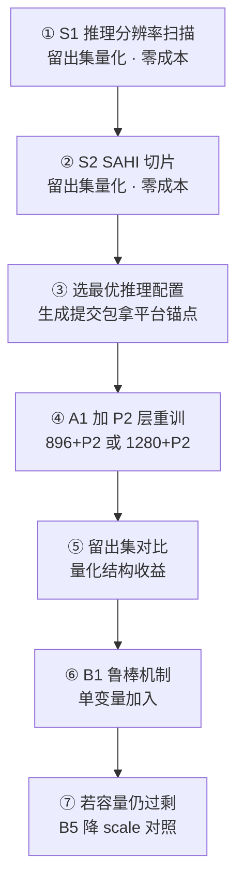

# AIC2026 复赛 V5 阶段分析总结：失分归因与提升方案

> 文档日期：2026-09-22
> 分析对象：`aic2026-yolo11x-rgbtd-V5`（yolo11x-RGBTD-gated，896/batch4，300 epoch，1700/300 留出集）
> 数据来源：全部为**实测数据**（V5 留出集权威指标 / 三次平台提交记录 / 留出集 2295 个真值框尺寸分布 / 特征图层级映射计算 / 模态质量抽样核验），非估算
> 关联产物：`复赛/模型_复赛第一版_V5/`、`复赛/小目标检测诊断与提升方案.md`、`复赛/成绩记录与归因分析.md`、`复赛/尺度泛化分析.md`、`复赛/框架评估_模型结构.md`

---

## 摘要：一句话结论

> **分数低不是因为训练超参没调好，而是因为模型在「背训练集」而不是「学规律」；而这 0.40 的泛化落差中，最大的可兑现空间集中在小目标的「检出」环节——当前 896+P3 的配置下，有 14.6% 的真值目标从结构上就站不住特征图。**

### 五个核心结论（按证据强度排序）

| # | 结论 | 关键证据 |
|---|---|---|
| 1 | **严重过拟合**：训练集自测 0.92 vs 留出集 0.518 vs 平台 0.53 | 落差 0.40；109.45M 参数 ÷ 2000 图 = 每图 5.5 万参数 |
| 2 | **训练配置不是瓶颈**：三次提交跨越巨大配置差异，分差仅 1.51 | 53.6 / 54.6 / 53.09；而榜首领先 11.4 分 = 内部波动的 **7.5 倍** |
| 3 | **域偏移假说被否定**：训练集与测试集同源同分布 | 亮度/空洞率差异全部在噪声内（空洞 30.9% vs 32.0%） |
| 4 | **唯一瓶颈是小目标**，且与样本数量无关 | 小目标占比 vs mAP `r = −0.836`；实例数 vs mAP `r = −0.160` |
| 5 | **失分在「检出」而非「定位」**（小目标维度） | Recall vs mAP50 `r = +0.979`；P3<2格占比 vs mAP50-95 `r = −0.855` |

---

## 一、成绩基线现状

### 1.1 平台真实分数（初赛榜，评测口径完全一致）

| 版本 | 权重配置 | 平台分数 |
|---|---|---|
| v1 | 640 / batch8 / **强增强** / val=true（择优） | **53.6** |
| v2 | 640 / batch8 / 弱增强 / val=false | **54.6** |
| v3（A 档） | **960** / batch4 / 弱增强+退化增强 / val=false | **53.09** |
| **排行榜最高分（他人）** | — | **66.0** |

```
我方三次：53.6 → 54.6 → 53.09      极差 1.51，均值 53.76
与榜首差距：66.0 − 54.6 = 11.4 分   （≈ mAP 0.114）
```

三次提交的**推理口径完全一致**（conf 0.001 / iou 0.7 / max_det 100 / 6 字段含 confidence / 置信度降序 / 1000 txt 平铺根目录），格式无差异 → **分数差异只能归因于权重**。

### 1.2 V5 首次带来可信的泛化指标 ⭐

V5 采用 **1700/300 留出集**（seed=42），这是本项目第一次拿到**不虚高的本地指标**：

| 口径 | mAP50-95 | 性质 |
|---|---|---|
| 训练集自测（A 档 三模态 960） | 0.914 | ❌ 虚高（模型背过答案） |
| 训练集自测（B1 双模态 1536） | 0.924 | ❌ 虚高 |
| **V5 留出集（300 张干净数据）** | **0.518**（best 0.5212 @epoch238） | ✅ **可信** |
| 平台真实分（同类评测口径） | 0.531 / 0.546 / 0.536 | ✅ 真实 |

**留出集 0.518 与平台真实分 0.53~0.55 几乎重合** —— 说明留出集评估可用（甚至略偏保守）。

> ✅ **这是本项目最重要的基建进展**：此后任何改进都能**当日量化**，不必再烧每天 2 次的提交额度去盲猜。
>
> 本地核验：本地重现划分后逐类实例数与 V5 日志**完全一致**（person 166/877、car 55/242、light 71/210…合计 2295 框），证明划分复现与标签版本（`new_labels_2000` 修订版）均正确。

---

## 二、失分问题诊断（重点）

### 问题 1：严重过拟合 —— 模型在「背训练集」，不是「学规律」🔴

**这是最根本的问题。** 三个数字并列即可看清：

```
训练集自测      0.88 ~ 0.92    ← 模型对"自己见过的 2000 张"
V5 留出集       0.518          ← 模型对"同源但没见过的 300 张"
平台真实分      0.531 ~ 0.546  ← 模型对"同源但没见过的官方测试集"
```

**落差约 0.40。而同源、同分布（见问题 3）的情况下还掉 0.40 —— 唯一解释就是过拟合。**

**V5 的过拟合曲线证据（首次基于干净 val）**：

| epoch | train_box | val_box | train_cls | val_cls | mAP50-95 |
|---|---|---|---|---|---|
| 1 | 3.594 | 3.057 | 5.299 | 3.756 | 0.0019 |
| 101 | 1.240 | 1.315 | 0.780 | 0.850 | 0.4470 |
| 201 | 0.877 | 1.279 | 0.471 | 0.776 | 0.5030 |
| **238** | — | — | — | — | **0.5212**（峰值） |
| 300 | **0.689** | **1.272** | **0.351** | **0.788** | 0.5120 |

- **100 轮后 train loss 继续降 44%**（1.240→0.689），**val loss 只降 3%**（1.315→1.272）
- val loss 在 150~200 轮后**转为轻微回升**（box 1.2753→1.2800、cls 0.7743→0.7921）
- mAP 在 238 轮达峰后微降 0.009，后 50 轮在 0.508~0.521 平台震荡

**三个叠加成因**：

| # | 因素 | 证据 |
|---|---|---|
| 1 | **容量 / 数据严重失衡** | 109.45M 参数 ÷ 2000 图 = **每图摊 5.5 万参数** |
| 2 | **类别长尾极端** | 12 类中 5 类不足 300 框，最少 `tricycle` 仅 **25 框**（最多类 5499 框，**差 220 倍**） |
| 3 | **标注噪声** | 新旧标签 **19.1% 内容不一致**（382/2000 文件）；原标签含 412 个越界框 |

**印证信号**：`person` 是训练集最大类（5499 框 / 2.75 框每图），但历史版本预测只有 **1.16 框/图**（漏检约 58%）。**"最大类反而欠检"是被压制、而非学会了规律的典型特征。**

---

### 问题 2：训练配置不是瓶颈 —— 已被三次实验排除 🔴

三次提交跨越的配置空间**极大**：

| 维度 | v1 → v2 → v3 变化 | 幅度 |
|---|---|---|
| 深度增强 `depth_jitter_prob` | 1.0 → 0.0 → 0.0 | 从"每张图都抖"到"完全不抖" |
| 可见光丢弃 `rgb_drop_prob` | 0.2 → 0.05 → 0.05 | 降为 1/4 |
| 推理分辨率 | 640 → 640 → **960** | 有效像素 **×2.25** |
| 权重择优 | 300 轮选最优 → 覆盖式 → 覆盖式 | 语义完全不同 |
| 正则化 | wd 5e-4 → 同 → wd 1e-3 + cos_lr | 加强 |
| 退化增强 | 无 → 无 → 低照度/过曝/深度空洞 | 从无到有 |

**跨这么大的空间，平台分数只差 1.51 分。**

```
我方配置微调的波动幅度 :  1.51 分
与榜首的真实差距       : 11.4 分   ← 是前者的 7.5 倍
```

> 🔴 **推论：继续在「增强强度 / 分辨率 / 择优策略 / 正则化」上做微调，预期收益≈0（都在 ±1.5 分噪声带内）。11.4 分的差距不可能靠调参追平。**
>
> 而三次实验共用的**唯一常量 = `yolo11x` 主干（109.45M 参数）** —— 它本身从未被检验过。

---

### 问题 3：域偏移假说被否定 —— 训练集与测试集同源同分布

抽样各 150 张实测三模态图像质量：

| 模态 | 指标 | 训练集 | 测试集 | 差异 |
|---|---|---|---|---|
| 可见光 | 平均亮度 | 113.5 | 114.8 | 无 |
| 可见光 | 暗像素(<40)占比 | 8.5% | 9.0% | 无 |
| 可见光 | 过曝(>220)占比 | 5.6% | 3.9% | 无 |
| 红外 | 平均亮度 | 110.2 | 109.4 | 无 |
| 深度 | **零值(空洞)占比** | **30.9%** | **32.0%** | 无 |

**两个集合同源同分布** —— 测试集**不是**"特挑困难场景"。

> 🔴 **推论：不能把失分归给"测试集更难"。问题在模型侧。**

---

### 问题 4：唯一瓶颈是「目标尺寸」，与「样本数量」无关 ⭐

用 V5 在 300 张干净留出集上的逐类指标做相关性检验：

| 变量 | 与 mAP50-95 的相关系数 | 解读 |
|---|---|---|
| **小目标（面积<0.001）占比** | **r = −0.836** | ⭐ **极强负相关** |
| 面积中位 | r = +0.678 | 强正相关 |
| **实例数（样本量）** | **r = −0.160** | **几乎无关** |

**逐类明细（留出集 300 张）**：

| 类别 | 框数 | 面积中位 | 小目标占比 | mAP50-95 |
|---|---|---|---|---|
| **sign** | 123 | 0.00125 | **42.3%** | **0.368** ← 最低 |
| ball | 17 | **0.00071** | **58.8%** | 0.432 |
| bicycle | 102 | 0.00182 | 32.4% | 0.441 |
| **person** | **877（最多）** | 0.00201 | 35.2% | **0.443** |
| garbage_can | 46 | 0.00369 | 19.6% | 0.446 |
| boat | 19 | 0.00363 | 15.8% | 0.503 |
| animal | 533 | 0.00339 | 17.6% | 0.561 |
| car | 242 | 0.00233 | 9.9% | 0.563 |
| seat | 96 | 0.02060 | 8.3% | 0.585 |
| light | 210 | 0.00500 | 8.1% | 0.593 |
| **uav** | **28（很少）** | 0.00263 | 14.3% | **0.618** |
| tricycle | 2 | 0.03424 | 0% | 0.697 |
| **全体** | 2295 | — | — | **0.518** |

**两个决定性反例**：

- `person` 有 **877 个实例（全类最多）**，mAP 只有 **0.443**
- `uav` 仅 **28 个实例**，mAP 高达 **0.618**

> 🔴 **结论：否定"小类样本少所以学不好"的假设。性能排序基本由目标尺寸决定** —— 小目标占比 >30% 的四个类（sign / ball / bicycle / person）**全部垫底**（0.368~0.443）。
>
> **优化方向唯一：小目标检测能力。类别不平衡、样本数不是主要矛盾。**

---

### 问题 5：小目标的失分在「检出」，不在「定位」⭐（推翻了一个早期假设）

| 关系 | 相关系数 r | 强度 |
|---|---|---|
| **Recall vs mAP50** | **+0.979** | 极强 |
| Recall vs mAP50-95 | +0.925 | 极强 |
| 中位边长 vs 定位落差 | −0.227 | **弱** |

**物理根因已定位到特征图层级**：

| 关系 | r |
|---|---|
| **P3 上不足 2 格的框占比 vs mAP50-95** | **−0.855** ← 比"小目标占比"更精确 |

当前 **896 + P3(stride 8)** 下，**全局只有 85.4% 的真值框能站住特征图**（等效边长 ≥ 2 格），剩下 **14.6% 从结构上就检不出**。

| 类别 | 框数 | 896+P3 可检率 | 实测 Recall | 漏检率 |
|---|---|---|---|---|
| **person** | **877（占 38%）** | **77.3%** | **0.673** | 32.7% |
| sign | 123 | 77.2% | 0.537 | 46.3% |
| ball | 17 | 64.7% | 0.588 | 41.2% |
| bicycle | 102 | 85.3% | 0.559 | 44.1% |
| garbage_can | 46 | 84.8% | 0.607 | 39.3% |

> ⚠️ **可检率是必要条件，不是充分条件**：bicycle（14.7% ↔ 漏 44.1%）、garbage_can（15.2% ↔ 39.3%）的漏检**超出**不可检率缺口，说明还存在遮挡、密集、标注歧义等原因，光靠加检测层解决不了这部分。

**当前 896 分辨率下能站住的最小目标（原图像素）**：

| imgsz | P3 门槛 | P2 门槛 |
|---|---|---|
| **896（当前）** | **34.3 px** | 17.1 px |
| 1280 | 24.0 px | 12.0 px |
| 1920 | 16.0 px | 8.0 px |

**即：原图小于 34 像素的目标，在当前配置下从结构上就站不住。**

---

### 问题 6：定位落差是全类普遍问题（不是小目标专属）

| 指标 | V5 留出集 | A 档（训练集自测） | B1（训练集自测） |
|---|---|---|---|
| mAP50 | 0.782 | 0.985 | 0.992 |
| mAP50-95 | 0.518 | 0.912 | 0.924 |
| **落差** | **0.264** | 0.073 | 0.068 |

**在未见过的数据上，落差从 0.07 扩大到 0.26** —— "大致找到"没问题（AP50 0.782），**"框得准"是主要失分点**（十阈值平均只剩 0.518）。

12 类平均落差 **0.2645**（范围 0.164~0.350），**与目标尺寸只有弱相关（r=−0.227）**：

| 类别 | 落差 | 类别 | 落差 |
|---|---|---|---|
| uav | **0.350**（最大） | ball | 0.268 |
| person | 0.315 | animal | 0.261 |
| car | 0.309 | light | 0.255 |
| tricycle | 0.298 | bicycle | 0.252 |
| garbage_can | 0.278 | sign | 0.225 |
| | | boat / seat | 0.199 / **0.164** |

> 注意 `uav` 落差最大（0.350），而它的小目标占比只有 14% —— **说明这不是小目标专属问题，而是高 IoU 阈值段（AP75~AP95）全类普遍拿不到分。**

---

### 问题 7：框架结构层的四个弱点（从未被检验过）

| # | 弱点 | 实测证据 | 对应赛题要求 |
|---|---|---|---|
| **1** | **融合模块是项目里最简的一档，且三模态无备选** | `ModalConcat` 与 `NiNfusion` **逐行相同**（`Concat + 1×1 Conv + SiLU`），**无注意力、无门控、无通道重标定**；双模态有 41 个 YAML 可选，**三模态只有 1 个** | 鼓励"多源异构数据融合方法的创新改进" |
| **2** | **无模态缺失鲁棒机制** | `ModalConcat` 是**无条件 concat** —— 坏模态的特征照样进融合，模型没有任何机制去识别并降权 | ⚠️ **赛题明文**："一个或多个模态成像质量较差时，不应出现大幅性能波动" |
| **3** | **首次跨模态交互在 P3** | 三路分支各自跑完 4 次下采样后才见面，**浅层交互完全没利用** | — |
| **4** | **深度分支 3 倍冗余** | `base.py` 中深度图被复制成 3 份**完全相同**的值（`db,dg,dr` 同源）再走 3 通道卷积；而实测深度**约 30% 像素是空洞**，却被当正常像素处理 | — |

**实测可用的替代融合方案（11/11 全部可构建）**：

| 方案 | x 档参数量 | 相对基线 | 备注 |
|---|---|---|---|
| midfusion（当前同类） | 84.02 M | 基线 | |
| **EFM** | **84.02 M** | **±0.00 M** | 参数量完全相同 → 最干净的单变量替换（注：其 YAML 实际用的仍是普通 `Concat`） |
| add | 81.07 M | −2.95 M | 最轻 |
| CAS3 | 89.94 M | +5.92 M | 通道注意力 |
| **CFT3_add**（赛题参考文献） | **251.48 M** | **+167.5 M（2.99×）** | ⚠️ 参数量 3 倍，2000 张图上会显著加剧过拟合 |

---

### 问题 8：缺乏可信验证基础设施（v1~v4 全是盲测）

v1~v4 阶段**没有干净验证集**，所有自测都因 val 泄漏而虚高（0.90+），只能靠平台每天 2 次额度盲试：

| 阶段 | 验证方式 | 后果 |
|---|---|---|
| v1~v4 | val 100% 泄漏 / 全量训练无 val | 三次提交额度只换来"整体在 53~55 波动" |
| **V5（已修复）** | **1700/300 干净留出集** | ✅ 本地指标 0.518 ≈ 平台 0.53~0.55，**当日可量化** |

### 问题 9：`ball` 类存在标注可辨性问题（可能白投入）

| 实测指标 | 值 |
|---|---|
| 框数 / 图数 | 95 / 78（训练集，倒数第 2） |
| 中位尺寸 | **36 × 39 px**，32.6% 小于 32² |
| 与 person 同图率 | 82% |
| **被 person 框覆盖 >90% 的比例** | **56.8%** |
| 被 person 覆盖比例（中位） | **1.000（完全包含）** |
| ball 面积 ÷ 覆盖它的人框面积 | **0.0155**（球的面积只有人的 1.5%） |
| 类内正确率（训练集自测混淆矩阵） | **0.88（全类最低）** |
| 漏检率 | **0.11（全类最高）** |

> **即便是"背过答案"的训练集自测，ball 仍有 11% 完全检不出** —— 这不是学习不充分，是**信号本身不足**（绝大多数球被抱在怀里/拿在手上，可见部分只有几像素）。
>
> 佐证：官方标签修订（旧→新）**只动了 car(+24.1%) 和 light(+26.1%)，ball 仅 +6 框、bicycle 一框未改** —— 这两个类的标注**从未被复审过**。

### 问题 10：`bicycle` 的问题是「尺度极端不平衡 + 定位」

| 实测指标 | 值 | 含义 |
|---|---|---|
| 尺寸跨度（p5→p99） | **28 → 583 px（48 倍）** | 单回归头难以拟合 |
| <32px / ≥256px 占比 | 7.8% / **12.8%** | 典型双峰分布 |
| 每图最大实例数 | **22 个**（41 张图 ≥5 个） | 共享单车密集停放 |
| AP50 → AP50-95 | **0.992 → 0.905** | **检出没问题，定位才是失分点** |
| 漏检率 | 仅 4% | 不是"检不到" |

---

### 问题 11：跨域时小目标置信度崩塌（推理侧的直接证据）

用**同一权重（B1）**分别对训练集 2000 张与测试集 1000 张推理（口径完全一致）：

| conf 阈值 | 训练集真值 | B1@训练集 | B1@测试集 | 测试/训练 |
|---|---|---|---|---|
| ≥0.001 | 7.60 框/图 | 20.86 | 15.28 | 73% |
| **≥0.25** | **7.60** | **7.78（≈真值 102%）** | **4.90** | **63%** |

**在 conf≥0.25 下，模型在训练集上检出 7.78 框/图（真值 7.60，几乎完美），在测试集上只有 4.90（缺 35.5%）。**

| 集合 | 小目标密度 | 其中高置信占比 | 高置信小目标 |
|---|---|---|---|
| 训练集真值 | 1.53/图 | — | 1.53（基准） |
| B1@训练集 | 6.79/图 | **23.0%** | 1.56（**102%**）✅ |
| **B1@测试集** | 3.67/图 | **11.3%** | **0.41（27%）** ❌ |

> **同一模型、同一阈值，小目标高置信率从 23.0% 腰斩到 11.3%。**
>
> ⚠️ 关键排除项：在 conf≥0.001 下，**测试集小目标占比 24.0%，比训练集真值 20.1% 还高** —— 说明**测试集不缺小目标**（模型认为那儿有东西），只是**不敢确认**。这排除了"测试集物体更大"的解释。
>
> 逐类尺度响应比（高置信中位 ÷ 真值中位）：训练集列全在 **0.98~1.04**（无偏）；测试集列 person **1.77** / boat **1.69** / sign **1.53** —— **模型在测试分布上只敢认大目标**。

---

## 三、改进思路（按 ROI 排序）

### S 档 · 零训练成本，可立即执行 ⭐

| # | 手段 | 机制 | 预期 | 合规 |
|---|---|---|---|---|
| **S1** | **推理分辨率扫描**（896→1280/1536，FixRes） | 小目标在特征图上占更多格 | 高 | ✅ 同一模型多尺度 |
| **S2** | **SAHI 切片推理** | 把大图切片放大后检测，等效极大提升小目标格数 | **最高** | ✅ 同一模型，非集成 |
| **S3** | **TTA**（`augment=True`，多尺度+翻转） | 尺度敏感问题最直接的缓解 | 中 | ✅ 国内赛通常允许 |
| **S4** | **NMS iou 扫描**（0.6~0.75） | 密集小目标场景的框保留策略 | 中低 | ✅ 后处理 |

> **S1 尤其值得先做**：V5 训练于 896，但原图是 1920×1080，推理时提高分辨率往往**不重训就能涨**（FixRes 效应）。**这是唯一可能"白拿"的分数**，且用留出集就能量化，不烧提交额度。
>
> **S2/S3 合规性**：两者都是"同一模型的多尺度/切片推理"，不属于赛题禁止的"多模型集成（投票/平均）"。保守起见建议**同时保留非 TTA 版本**以便随时切换。

### A 档 · 一次重训（12~24 小时）

| # | 手段 | 机制 | 预期 | 成本 |
|---|---|---|---|---|
| **A1** | ⭐ **加 P2 检测层（stride=4）** | 可检率 **85.4% → 98.4%（+12.9 pt）** | **最高** | **已就绪**：仅 +0.88 M 参数（+0.8%）、+10.3% GFLOPs |
| **A2** | **小目标过采样 / Copy-Paste** | 提升小目标在损失中的权重 | 中高 | 需改 dataloader |
| **A3** | **正样本分配调整**（TAL IoU 阈值 / topk） | 让小目标更易被分配为正样本 | 中 | 需改 loss 分配 |
| **A4** | **1280 分辨率重训**（配合 A1） | 可检率平移到 99.9% | 高 | 时间 ×2 |

**⭐ 杠杆对比（决定性数据）**：

| 配置 | 可检率 | 相对基线 | 相对算力 |
|---|---|---|---|
| **896 + P3（当前 V5）** | **85.4%** | — | 1.0× |
| 1280 + P3 | 94.1% | +8.6 pt | 2.0× |
| 1920 + P3 | 99.0% | +13.6 pt | **4.6×** |
| **896 + P2** | **98.4%** | **+12.9 pt** | **1.10×** |
| **1280 + P2** | **99.9%** | **+14.4 pt** | ⭐⭐ 最优组合 |

> **加一个 P2 检测层 = 用 1.10 倍算力拿到 1920 分辨率 95% 的效果。**
>
> **未饱和前的边际收益**：896+P3 → 896+P2 是 **+12.9 pt**；896+P2 → 1280+P2 只剩 +1.5 pt；1280+P2 → 1536+P2 几乎为 0（饱和）。
> **所以最优组合是「1280 + P2」，再多提分辨率是纯浪费。**

**V6（P2 检测层）已就绪可直接开训**：

| 文件 | 作用 | 验证状态 |
|---|---|---|
| `ultralytics/cfg/models/11-RGBT/yolo11-RGBTD-gated-p2.yaml` | V6 模型（V5 + P2 检测层） | ✅ 构建 / 参数量 / GFLOPs / 前向 |
| `_transfer_v5_to_v6.py` | V5 → V6 权重迁移（warm-start） | ✅ 本地自检通过 |
| `train_RGBTD_V6.py` | V6 训练脚本（超参与 V5 逐项一致） | ✅ 语法通过 |

| 指标 | V5 | **V6（+P2）** | 变化 |
|---|---|---|---|
| 参数量 | 112.59 M | **113.47 M** | **+0.88 M（+0.8%）** |
| GFLOPs @896 | 479.31 | **528.48** | +10.3% |
| 检测尺度 | P3/P4/P5 | **P2/P3/P4/P5** | stride `[4,8,16,32]` ✅ |

**迁移策略**：V5 best.pt → V6 的 **warm-start**（V5 已学会 12 类，加 P2 只是增量学习），比从 COCO 重训收敛快得多。本地自检：区域1 迁移 1371 项、head 迁移 396 项，**V5 的 P3/P4/P5 检测分支权重完整保留**，仅 P2 分支 4 层随机初始化。

### B 档 · 结构性改进（中等成本，需单变量对照）

| # | 手段 | 说明 | 依据 |
|---|---|---|---|
| **B1** | ⭐ **模态缺失鲁棒机制**（模态 dropout / 门控融合） | 训练期随机屏蔽整条模态，强制学习降级工作 | ⚠️ **赛题明文要求**；且问题 11 已实测证明跨域时模态置信度崩塌 |
| **B2** | **融合模块升级** | 从 `ModalConcat` 换为带跨模态交互的模块 | 问题 7 弱点 1；建议先做**参数量零变化**的 EFM 做单变量检验 |
| **B3** | **浅层交互**（P2 尺度融合） | 让三模态在更浅层就交汇 | 问题 7 弱点 3 |
| **B4** | **深度分支单通道化** | 深度是标量几何量，3 通道复制是纯冗余（数据侧零改动） | 问题 7 弱点 4 |
| **B5** | **模型容量下调**（s 18.11M / m 39.42M） | 缓解"每图 5.5 万参数"的容量过剩 | 问题 1 |
| **B6** | **250 轮 + 早停** | 后 100 轮 4 小时只换来 +0.009 分 | 问题 1 的过拟合曲线 |
| **B7** | **NWD / IoU 变体损失** | 针对全类普遍的 0.2645 定位落差 | 问题 6 |

**容量对照表（实测参数量）**：

| scale | RGBTD 三模态 | 相对 x | 备注 |
|---|---|---|---|
| n | 4.79 M | 1/22.8 | ⚠️ 可能欠拟合（要同时学 3 模态融合 + 12 类） |
| **s** | **18.11 M** | **1/6.0** | 较稳的下限 |
| **m** | **39.42 M** | **1/2.8** | |
| l | 48.71 M | 1/2.2 | |
| **x（当前）** | **109.45 M** | — | |

### 已排除的方向（不要再投入）❌

| 方向 | 排除依据 |
|---|---|
| ❌ 继续微调增强强度 | 三次提交已证明 ±1.5 分内无感（问题 2） |
| ❌ 单独提高分辨率 | v3 的 960 已证明无效；且单纯提分辨率的算力代价是 P2 方案的 **4.6 倍**（问题 5） |
| ❌ 减少模态（去深度） | B1 双模态（84M + 1536）自测 0.924，与 A 档 0.914 同量级，未跳出能力带 |
| ❌ 归因"域偏移 / 测试集更难" | 已实测否定（问题 3） |
| ❌ 在无干净验证集时启动多组对照 | 三次提交额度的教训（问题 8） |
| ❌ 直接上 CFT / RDBB 等大参数融合模块 | 参数量 2.8~3 倍，在 2000 张图上会显著加剧过拟合（问题 7） |

### 执行路线图



**顺序理由**：
1. ①② 是**零成本、可量化、可能白拿分**的，必须先做；
2. ③ 先用当前最优配置拿一个**平台锚点**；
3. **④ 之前不要重训** —— 如果 S1/S2 就能拿到大部分收益，A1 的边际价值会被压缩；
4. ⑤ 之后每次**只改一个变量**（单变量对照），否则又是"改 6 个变量、分数无法归因"的老问题。

---

## 四、风险与边界（必须说清）

1. **可检率是必要条件，不是充分条件**。12.9 pt 的可检率提升**不等于** 12.9 分的 mAP 提升 —— 它只说明"结构上不再被卡住"，实际收益要靠留出集实验兑现。

2. **bicycle / sign / garbage_can 的漏检超出可检率缺口**，说明还有遮挡、密集、标注歧义等原因，**P2 层解决不了这部分**。

3. **P2 层的训练显存增量尚未实测**（本地无 GPU）。P2 特征图是 P3 的 4 倍面积，显存会上升，需在服务器实测后才能定 imgsz/batch。

4. **所有类别级结论基于留出集 300 张 / 2295 框**，样本量对长尾类（ball 17、boat 19、tricycle 2）统计噪声较大，这些类的结论仅供参考。

5. **V5 的四项结构改动无法单独归因** —— 它同时改了 6 个变量（融合模块 / 模态 dropout / P2 浅层交互 / 深度通道数 / 分辨率 960→896 / 验证口径）。`留出集 0.521 与历史平台分 0.53~0.55 处于同一量级，未观察到显著提升`。

6. **`ball` 存在"战略性放弃"的可能**：若抽查确认人眼都难辨（56.8% 完全落在 person 框内），则所有队伍在此都失分，追它的性价比会远低于预期 —— **建议先做标注可辨性抽查（不花提交额度）再决定是否投入**。

7. **mAP50-95 是 12 类等权平均**，每类权重都是 1/12，与实例数无关。把一个类抬高 0.10，总分就 +0.83 分，**与抬高任何一类等价** —— 所以"小类不重要"是错的。

8. **真实分数只能靠平台**：官方测试集无真值标签，本地无法计算 mAP。留出集指标可用于**同源对比排序**，但绝对值仍需平台反馈验证。

---

## 五、待办与阻塞项

| 事项 | 状态 |
|---|---|
| 训练服务器实例 | 🔴 **已关闭**（连续 9 次 `ConnectionRefused`，非网络波动） |
| **V5 权重（best/last 各 226 MB）下载到本地** | ⏸ 阻塞 —— ⚠️ **训练成果目前只在服务器上，本地 `weights/` 为空，实例释放将不可恢复** |
| S1/S2 零成本实验 | ⏸ 阻塞 |
| V6（P2 检测层）开训 | ⏸ 阻塞（代码已就绪） |
| A 档 / B1 在同一留出集评估（量化记忆虚高幅度） | ⏸ 阻塞 |
| v4 提交包（复赛测试集，22547 框）提交平台 | ⏳ 待执行 |

---

## 附录：关键文件索引

| 文件 | 内容 |
|---|---|
| `复赛/模型_复赛第一版_V5/` | V5 全部产物：results.csv（300 轮）、args.yaml、权重、holdout_val_stems.json、三张诊断图 |
| `复赛/小目标检测诊断与提升方案.md` | 本文问题 4/5/6 的完整推导（含可检率计算与杠杆对比） |
| `复赛/成绩记录与归因分析.md` | 本文问题 1/2/3 的完整推导（含三次提交口径核验） |
| `复赛/尺度泛化分析.md` | 本文问题 11 的完整推导（同权重双集推理对照） |
| `复赛/弱类分析_ball_bicycle.md` | 本文问题 9/10 的完整推导（含混淆矩阵与空间重叠分析） |
| `复赛/框架评估_模型结构.md` | 本文问题 7 的完整推导（含 11 个融合方案逐个构建实测） |
| `复赛/方案_V5_门控融合.md` | V5 四项结构改动的设计与实现记录 |
| `ultralytics/cfg/models/11-RGBT/yolo11-RGBTD-gated-p2.yaml` | V6 模型（P2 检测层），已就绪待训 |
